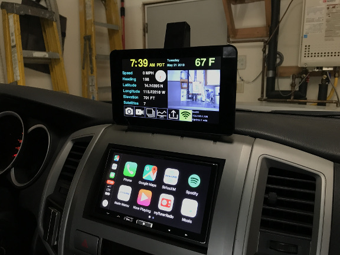

# Car computer

Software for a car computer (carputer) based on the Raspberry Pi.  This is installed in my 2008 Toyota Tacoma Prerunner.

This is the third carputer I have built over a period of about 15 years.  At first I tried to implement everything, but over time I realized that functions such as entertainment and navigation are better handled by commercially available units so I'm not attempting to do that any more.  I have an Alpine ILX-107 with wireless CarPlay connected to my iPhone that does these things as well as providing a backup camera.  For music I like to use Spotify or SiriusXM and for navigation I prefer Google Maps.  With this project I am focusing on some additional functions on a second screen that aren't readily available on the Alpine.

The software in this project consists of two applications that collect GPS and vehicle diagnostic data.  Both types of data are continuously logged to files.  The current values of each type are also written to files which are monitored by the user interface application contained in the jbuehl/ha project.  That application reads the GPS and diagnostic data from the current files, interfaces to the temperature sensor and camera module, and presents the user interface on the LCD touchscreen.

## Functions

### Time

The real time clock on the GPS board provides the current time immediately at startup and that is used to set the system time since there may not be a network connection to get it from a time server.  As soon as satellites are acquired the GPS time is used to update the RTC.  The system time is maintained as UTC.  The time and date that is displayed on the UI is converted to the local time zone that the vehicle is in based on the latitude and longitude reported by the GPS.

### Temperature

My vehicle can have an optional outside temperature sensor, but it is not installed.  I mounted an I2C temperature sensor in front of the radiator and interfaced it to the Raspberry Pi using a CAT5 cable.  The TC74 sensor only has a resolution of 1 degree C.  A better choice would be a DS18B20 which uses the 1-wire interface.

### GPS

The GPS data displayed is

- speed
- heading
- latitude
- longitude
- elevation
- number of satellites

Speed, heading, and elevation are provided from GPS data.  Because I had some issues with accuracy of the elevation with this GPS unit, the elevation is also calculated from the latitude and longitude using the Shuttle Radar Topography Mission data.  A button on the UI allows selection of this.  The number of satellites gives an indication of the quality of the GPS data.  

### Vehicle diagnostics

Vehicle diagnostic data is acquired from the CAN bus via the OBD-II connector.  This is interfaced through the UART board and serial to USB adapter.  The data displayed is

- engine RPM
- battery voltage
- intake air temperature
- coolant temperature
- barometric pressure
- diagnostic codes

There would have been a lot of other interesting metrics, but they aren't available in the standard OBD data that my vehicle provides.

The display can be toggled between GPS and diagnostic data.

### Dash camera

The 8MP Raspberry Pi camera module is mounted in a small enclosure that is attached to the top of the carputer case.  It connects with a ribbon cable.  A window on the display constantly shows the real time image that the camera sees.  Buttons on the user interface allow capturing a still image, starting/stopping recording of video, or changing the speed of the recorded video.  Still images and videos are stored on the RaspberryPi SD card.

### Network functions

The Raspberry Pi has wifi capability.  One or more networks can be configured and it will attempt to connect to any of them that are in range.  When connected, the SSID of the network and the IP address it provided are displayed.  A button on the user interface allows the wifi to be turned on and off.  Another button initiates the upload of all the data (GPS, diagnostics, images, videos) to a server.

## Hardware

More details about the hardware coming.

### Raspberry Pi 3 B+ - https://www.sparkfun.com/products/14643
### LCD touchscreen - https://www.sparkfun.com/products/13733
### Camera module - https://www.sparkfun.com/products/14028
### GPS module and RTC - https://www.adafruit.com/product/2324
### GPS antenna and adapter - https://www.amazon.com/gp/product/B00JE4GV8S https://www.amazon.com/gp/product/B01AJQ33Y4
### OBD-II UART and USB adapter - https://www.sparkfun.com/products/9555 https://www.sparkfun.com/products/9716
### Temperature sensor - http://ww1.microchip.com/downloads/en/devicedoc/21462d.pdf
### Voltage converter - https://www.amazon.com/GEREE-Waterproof-Converter-Adapter-Connector/dp/B00OXZ06I4
### Case - https://www.amazon.com/Raspberry-Pi-7-Inch-Touch-Screen/dp/B01GQFUWIC
### Camera case - https://www.amazon.com/gp/product/B00IJZOT5A

## Software

### Raspbian - https://www.raspberrypi.org/downloads/raspbian/
### gps.py
### diags.py
### carApp.py - https://github.com/jbuehl/ha/blob/master/carApp.py
